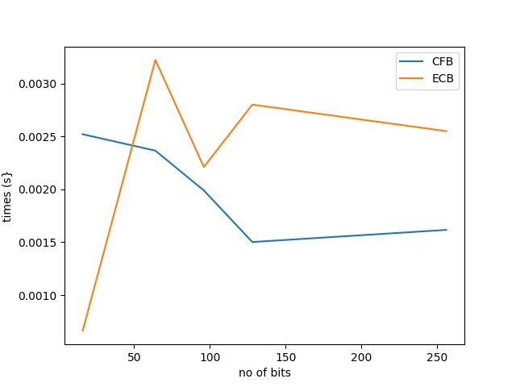
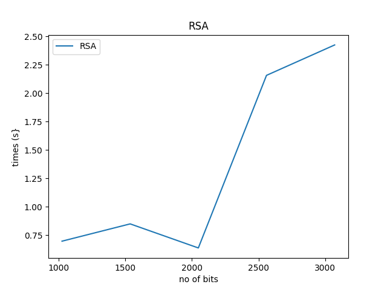

# Authors:

### [Baibars Filomatheinista (2017331010) ](https://github.com/bai-bars) <br> [ Abdullah (2017331088) ](https://github.com/raihan88)
<hr>

## DEPENDENCIES:
To run our code you have to install one third-party package:
> `pip install pycryptodome`

<hr>

<h1 align="center">GENERATE KEY</h1>

__command__ :

```shell 
python3 pyssl.py --gen_key [options] -l [no_of_bits]
```

>1. `--gen_key` can be `aes` or `rsa`<br>
>2. `-l` is number of bit length. for aes it can 128 or 256 and for rsa it can be 1024 or 2048<br><br>


__Example 1(AES Key)__ :

```shell
python3 pyssl.py --gen_key aes -l 128
```

__Example 2(RSA Key)__ :
```shell
python3 pyssl.py --gen_key rsa -l 1024
```
<h1 align="center">ENCRYPTION DECRYPTION</h1>

__ENCRYPTION COMMAND__ : 
```shell
python3 pyssl.py -e [encryption options] -k [generated key] -v [generated iv] -i [input file] -o [output_file]
```

__DECRYPTION COMMAND__ : 
```shell
python3 pyssl.py -d [encryption options] -k [generated key] -v [generated iv] -i [input file] -o [output_file]
```
<br><br>
__options__:
> 1. `-e` for encryption and `-d` for decryption. These both options take types of encryption.
> > i.`aes-128-cfb` for 128 bit cfb <br>
> > ii.`aes-256-cfb` for 256 bit cfb  <br>
> > iii.`aes-128-ecb` for 128 bit ecb <br>
> > iv. `aes-256-cfb` for 256 bit ecb <br>
> > v. i.`rsa` for rsa encryption. Here number of bit depends on the number of bits in the key <br>
> 2. `-k` for key.
> > i. Value should be string for aes.<br>
> > ii. Value should be `.pem` file . Be careful: For encryption use the `public key` and for decryption use `private key`
> 3. `-v` it will take iv value. No iv for ecb
> 4. `-i` for input file name
> 5. `-o` for output file name
<hr>
   
## For AES (ECB/CFB 128/256):
__ENCRYPTION COMMAND__ : 
```shell
python3 pyssl.py -e [encryption options] -k [generated key] -v [generated iv] -i [input file] -o [output_file]
```

__FOR DECRYPTION COMMAND__ : 
```shell
python3 pyssl.py -d [encryption options] -k [generated key] -v [generated iv] -i [input file] -o [output_file]
```

<br>
<br>

__Encryption example 1__ : 
```shell
python3 pyssl.py -e aes-256-cfb -k t7EQ9iArWRM7vq9WUKWJqGSL5ImT5zn3 -v gWCZ0LbzD8ByaKc0 -i plain.txt -o output.txt
```

__Decryption example 1__ : 
```shell
python3 pyssl.py -d aes-256-cfb -k t7EQ9iArWRM7vq9WUKWJqGSL5ImT5zn3 -v gWCZ0LbzD8ByaKc0 -i output.txt -o plain_back.txt
```

<br> <br>

__Encrytption example 2__ :
```shell
python3 pyssl.py -e aes-128-ecb -k t7EQ9iArWRM7vq9W -i plain.txt -o output.txt
```

__Decrytption example2__ :
```shell
python3 pyssl.py -d aes-128-ecb -k t7EQ9iArWRM7vq9W -i output.txt -o plain_back.txt
```

<hr>

##  For RSA:
__ENCRYPTION COMMAND__ : 
```shell
python3 pyssl.py -e [encryption options] -k [public key file] -i [input file] -o [output_file]
```

__DECRYPTION COMMAND__ :
```shell
python3 pyssl.py -d [encryption options] -k [private key file] -i [input file] -o [output_file]
```

<br><br>

__Encryption example 1__ : 
```shell
python3 pyssl.py -e rsa -k publicKey.pem -i rsa_plain.txt -o output.txt
```

__Decryption example 1__ : 
```shell
python3 pyssl.py -d rsa -k privateKey.pem -i output.txt -o plain_back.txt
```

>`NOTE: python3 gen_key.py --mode rsa -l 1024`. It will create two files. One for public key and another for private key

<hr>

## For SHA256:
__COMMAND__ :
```shell
python3 pyssl.py -h SHA256 -i [input file]
``` 

__Example 1__ :
```shell
python3 pyssl.py -h SHA256 -i plain.txt
```

<hr>

<h1 align="center">VERIFY SIGNATURE</h1>

__CREATE SIGNATURE COMMAND__:
```shell
python3 pyssl.py -e create-rsa-signature -i [input file] -s [signature output file] -k [private key file]
```

__VERIFY SIGNATURE COMMAND__:
```shell
python3 pyssl.py -e verify-rsa-signature -i [input file] -s [signature output file] -k [public key file]
```

<br> 

__create signature example__ :
```shell
python3 pyssl.py -e create-rsa-signature -i rsa_plain.txt -s signature.txt -k privateKey.pem
```

__verify signature example__ :
```shell
python3 pyssl.py -e verify-rsa-signature -i rsa_plain.txt -s signature.txt -k publicKey.pem
```

<hr>

## Perfomance Test:

__We performed some performance test in terms of time:__<br>

ECB AND CFB:



RSA:



## Credits:
1. https://pycryptodome.readthedocs.io/
2. https://www.delftstack.com/howto/python/rsa-encryption-python/
